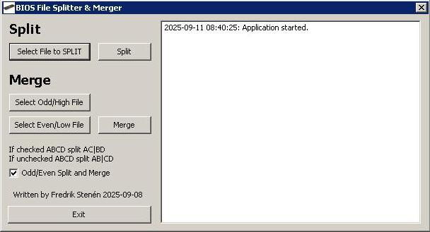

# BIOS Splitter/Merger Tool

---

## Overview
A Lazarus/Free Pascal tool to split and merge binary files using either odd/even byte separation or first half/second half division. Useful for backup, modification, or transferring large files in parts.

---

## Features
- Split files into **odd/even bytes** or **first half/second half**
- Simple GUI for selecting files and toggling split modes
- Logs all actions for easy tracking

---

## Requirements
- For compiling Lazarus 4 (or Free Pascal with LCL)
- Tested on **Windows**

---

## Usage

### 1. Select a File to Split
- Click **"Select File to SPLIT"** and choose the file you want to split
- The selected file path will appear in the log

### 2. Choose Split Mode
| Option                  | Output Files                     | Use Case                     |
|-------------------------|----------------------------------|------------------------------|
| **Odd/Even Split**      | `_odd.bin`, `_even.bin`          | Interleaved byte separation  |
| **First Half/Second Half** | `_first.bin`, `_second.bin`   | Equal half division          |

### 3. Split the File
- Click the **"Split"** button
- The software will create two new files in the same directory as the original file:
  - If **Odd/Even Split** is selected: `[OriginalFilename]_odd.bin` and `[OriginalFilename]_even.bin`
  - If **First Half/Second Half Split** is selected: `[OriginalFilename]_first.bin` and `[OriginalFilename]_second.bin`

#### How Splitting Works
- **Odd/Even Split**: Separates the file into odd and even bytes. For example, a file with bytes `A B C D` will be split into `A C` (odd) and `B D` (even)
- **First Half/Second Half Split**: Divides the file into two equal halves. For example, a file with bytes `A B C D` will be split into `A B` (first half) and `C D` (second half)

### 4. Merge Files
- Click **"Select Odd File"** (or **"Select First File"** if in First Half/Second Half mode) and choose the first split file
- Click **"Select Even File"** (or **"Select Second File"** if in First Half/Second Half mode) and choose the second split file
- Click the **"Merge"** button
- The software will combine the files into a new file named `merged.bin` in the same directory as the first selected file

#### How Merging Works
- **Odd/Even Merge**: Interleaves bytes from the odd and even files. For example, if the odd file contains `A C` and the even file contains `B D`, the merged file will be `A B C D`
- **First Half/Second Half Merge**: Concatenates the first half and second half files. For example, if the first file contains `A B` and the second file contains `C D`, the merged file will be `A B C D`

---

## Code Logic

### Splitting
- **Odd/Even Split**: Reads each byte sequentially and writes odd-positioned bytes to `_odd.bin` and even-positioned bytes to `_even.bin`
- **First Half/Second Half Split**: Reads the file and writes the first half of the bytes to `_first.bin` and the second half to `_second.bin`

### Merging
- **Odd/Even Merge**: Reads one byte from the odd file and one byte from the even file alternately, writing them to `merged.bin`
- **First Half/Second Half Merge**: Reads all bytes from the first file followed by all bytes from the second file, writing them to `merged.bin`

---

## Example Workflow

### Splitting a File
1. Load `example.bin`
2. Ensure **"Odd/Even Split"** is checked
3. Click **"Split"**
4. Output: `example_odd.bin` and `example_even.bin`

### Merging Files
1. Select `example_odd.bin` as the odd file
2. Select `example_even.bin` as the even file
3. Click **"Merge"**
4. Output: `merged.bin` (identical to the original `example.bin`)

---

## Notes
- [ ] Backup your files before splitting/modifying
- [ ] Ensure you have write permissions in the directory where the files are located
- [ ] The log displays all actions and errors for easy troubleshooting

---

## Troubleshooting

| Issue                          | Solution                                                                 |
|--------------------------------|--------------------------------------------------------------------------|
| **"File not selected"**        | Ensure you have selected both files before clicking **Merge**            |
| **"File access denied"**       | Check file permissions and ensure the files are not open in another program |
| **Incorrect output**           | Verify that you selected the correct files for merging                  |

---

## Future Improvements
- [ ] Add support for splitting into more than 2 parts
- [ ] Implement CRC checking for file integrity
- [ ] Support drag-and-drop for file selection

---

## License
MIT
